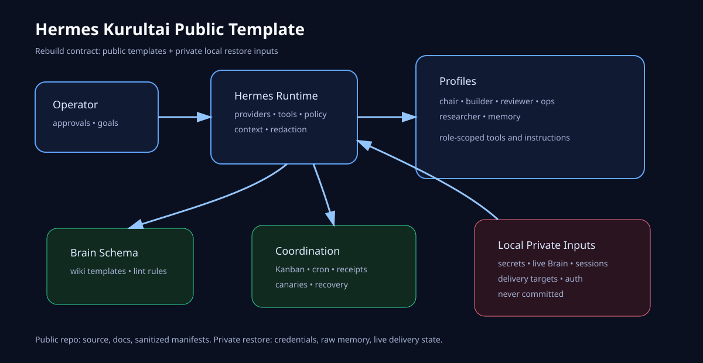

# Hermes Kurultai Public Template

A public, rebuildable template for a full Hermes-based personal/organizational agent setup: multi-profile agents, Kanban coordination, cron continuity, tool policy, skills, Brain/wiki memory, recovery/receipts, and deployment-safe runbooks.

This repository is intentionally a **replication contract**, not a dump of a live home directory. It lets you reproduce the architecture elsewhere without publishing secrets, private chats, OAuth state, customer data, live Brain pages, delivery targets, logs, sessions, or local databases.



## What is included

- Sanitized Hermes configuration templates and a live-structure manifest.
- Profile roster pattern for a chair/caretaker plus specialist worker agents.
- Kanban and cron operating model.
- Brain/wiki schema, templates, lint rules, and export/import runbooks.
- Recovery/receipts pattern for canaries, regressions, proposals, and rollbacks.
- Bootstrap scripts with `--dry-run` and safe defaults.
- Validation and secret-scan tests for public repo hygiene.

## What is deliberately excluded

- API keys, OAuth caches, cookies, session DBs, auth files, and private env files.
- Messaging delivery targets: chat IDs, phone numbers, bot tokens, Discord/Telegram state.
- Live Brain pages, raw captures, private indexes, hard-private folders, people dossiers, attachments, and transcripts.
- Production deploy credentials, payment/Stripe data, customer data, and local private repos.
- Live profile identity text or personal memory; recreate these locally from the templates.

## Quick start

```bash
git clone https://github.com/Danservfinn/hermes-kurultai-public-template.git
cd hermes-kurultai-public-template
./scripts/bootstrap.sh --home "$HOME/.hermes-replica" --brain "$HOME/brain-replica" --dry-run
./scripts/bootstrap.sh --home "$HOME/.hermes-replica" --brain "$HOME/brain-replica"
python3 tests/validate_repo.py
```

Then install Hermes Agent normally and point it at the generated home/profile. Fill in local secrets through your own secret manager, never by committing them here.

## Repository map

- `config/` — safe Hermes templates and tool policy.
- `profiles/` — profile templates and role contracts.
- `brain/` — public Brain/wiki schema, templates, and lint contract.
- `manifests/` — sanitized structural manifests generated from the live system.
- `docs/` — architecture, replication, security boundaries, recovery, and operations.
- `scripts/` — bootstrap and manifest export helpers.
- `tests/` — deterministic repo validation and public-secret scan.

## Public/private boundary

The live system's private state is restored from local inputs that you already control. This repo should answer: *what systems exist, how do they fit together, what files need to be created, what must be configured locally, and how do we verify a healthy replica?* It should not answer: *what are the operator's tokens, chats, sessions, raw notes, customer records, or private memories?*
